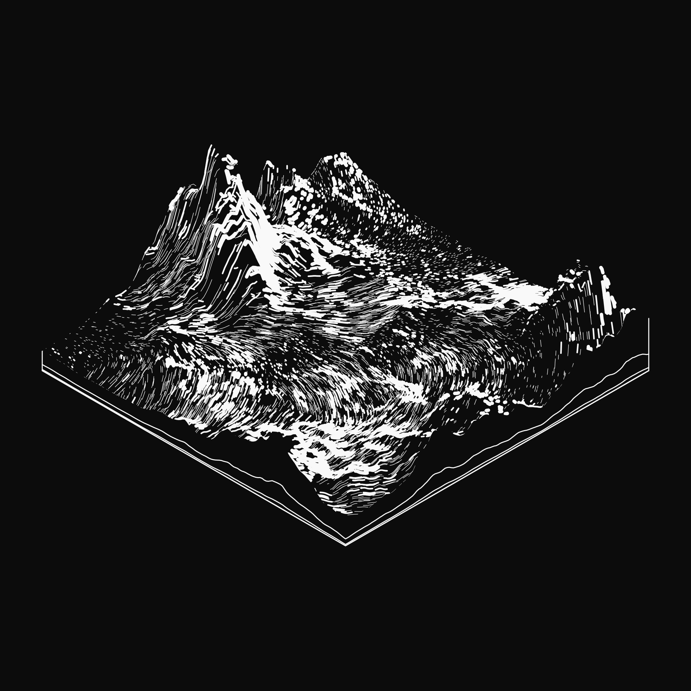
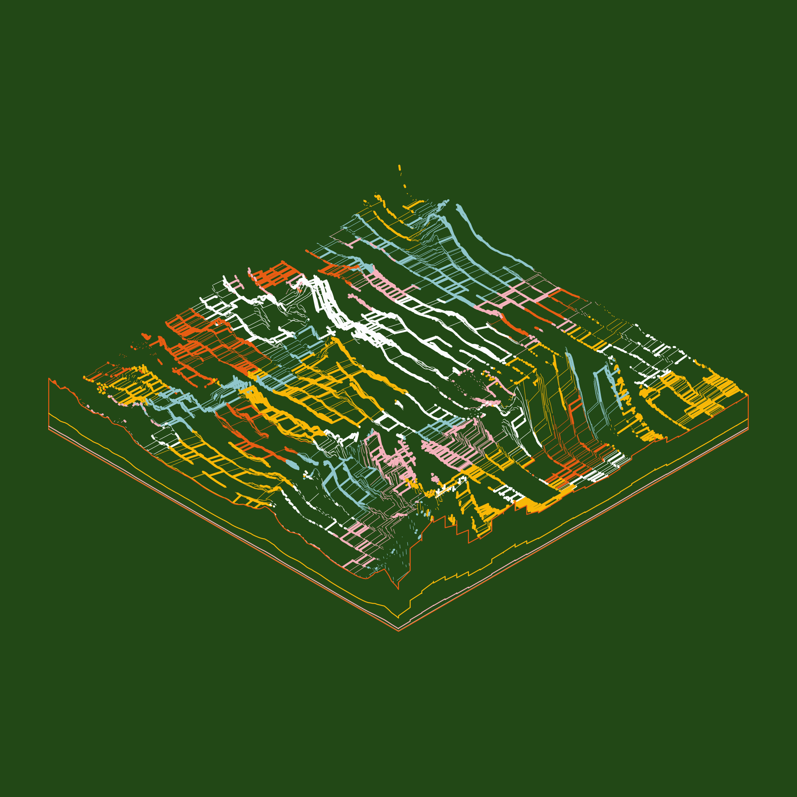
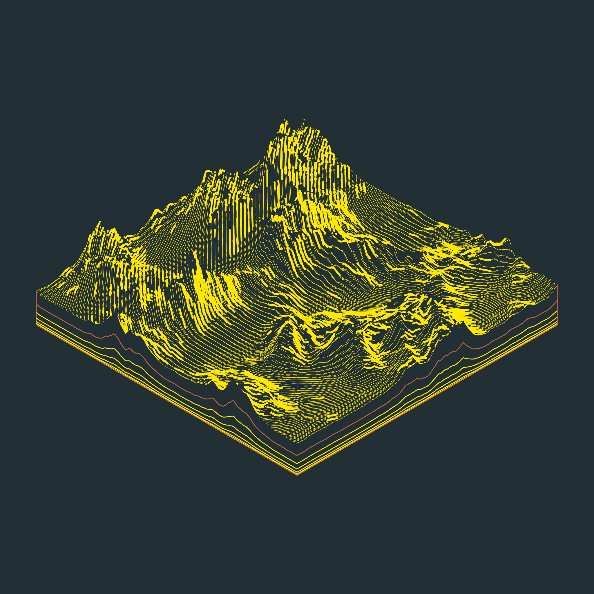
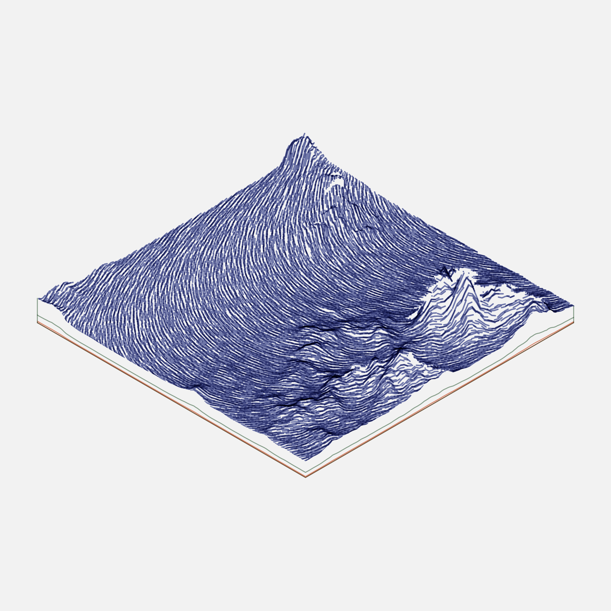
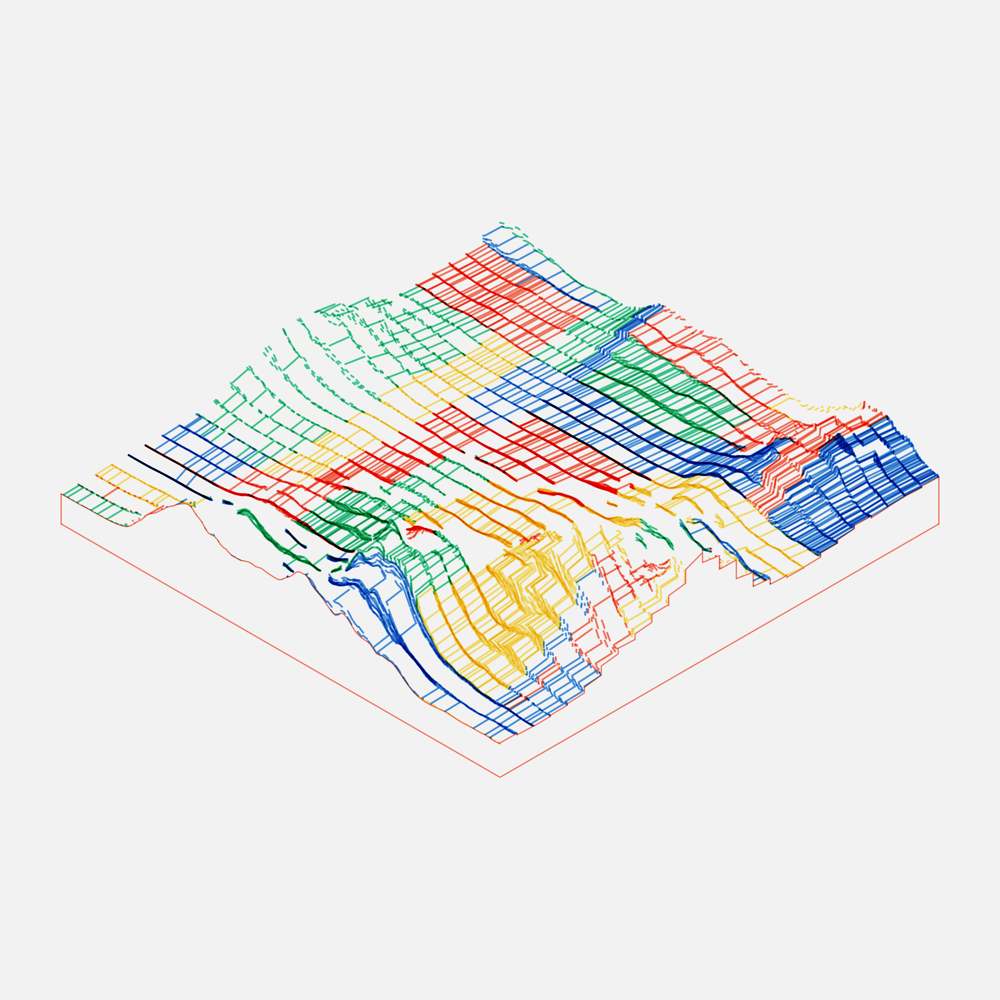
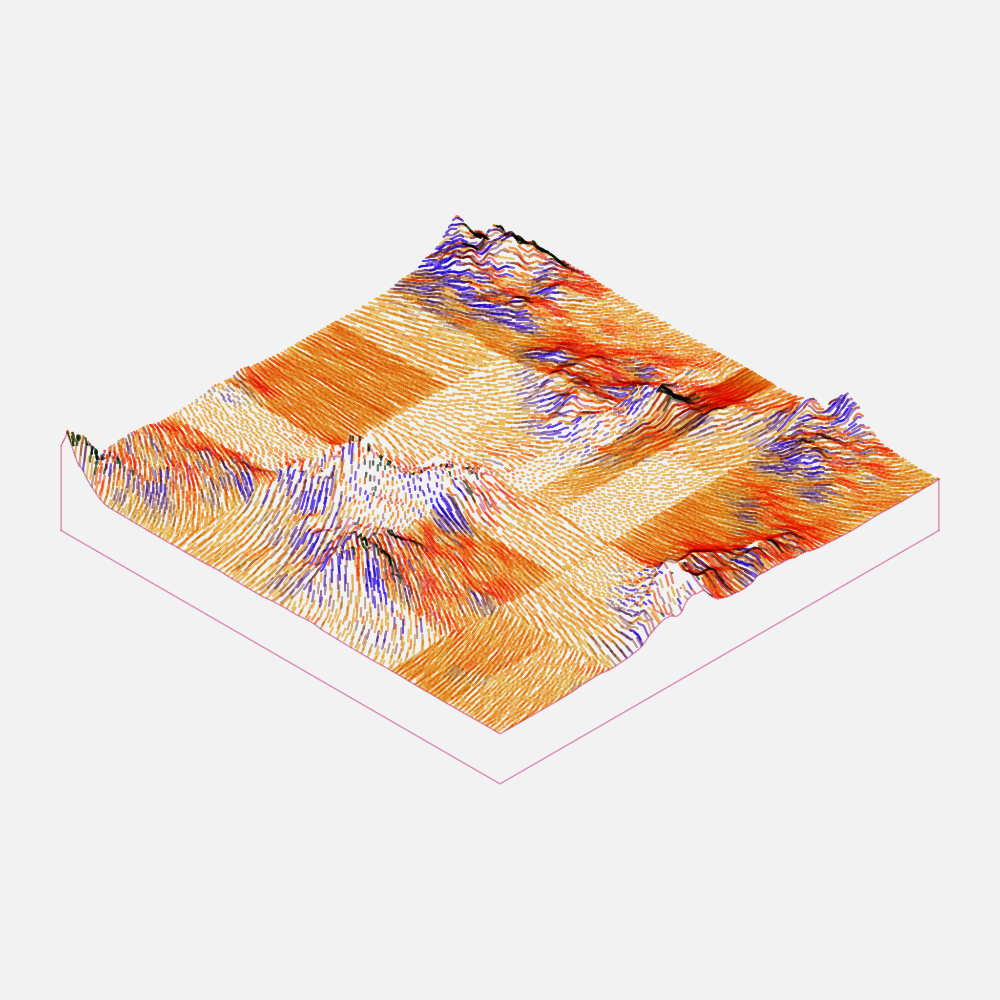
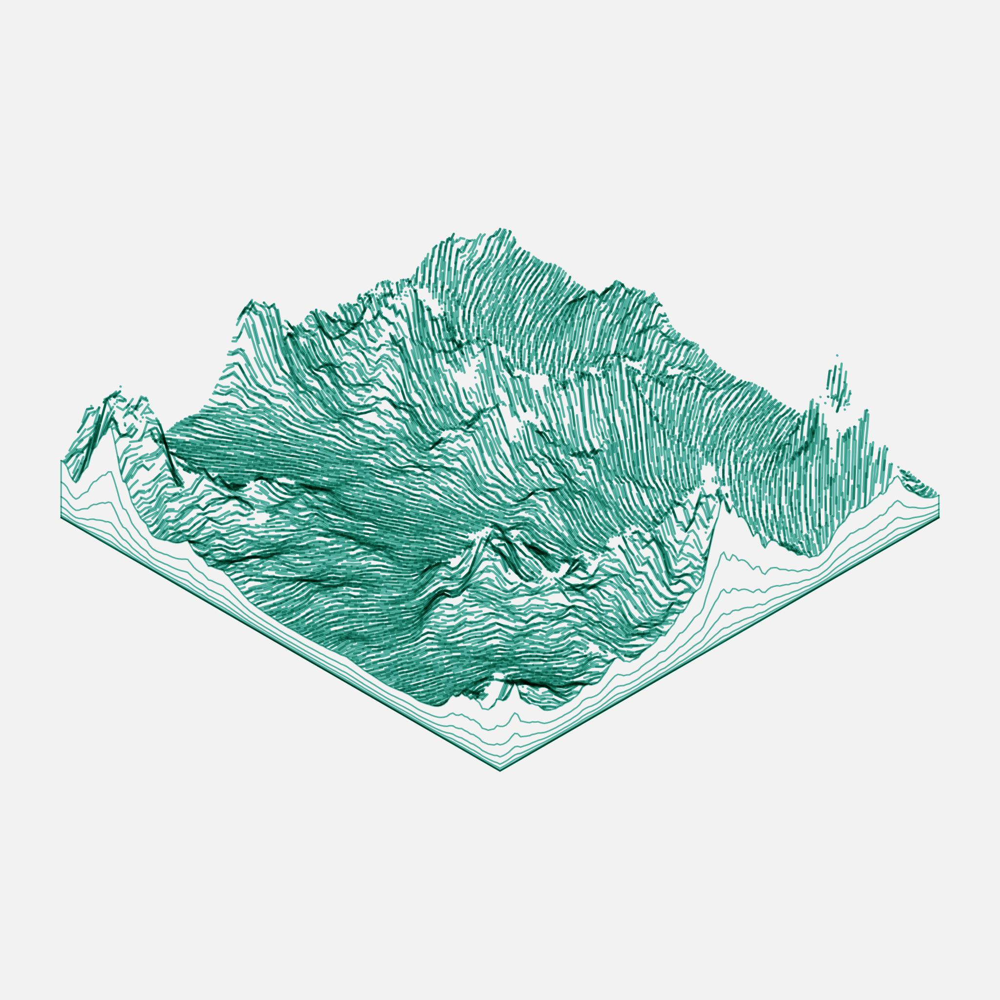

# Subscapes

:wrench: Tooling for the [Subscapes](https://artblocks.io/project/53) generative art project by Matt DesLauriers.



## About Subscapes

Subscapes is a generative art project where the core rendering code is immutably secured & hosted on the Ethereum mainnet blockchain. The program accepts a unique *hash* as a seed, and outputs the corresponding artwork using a determinstic generative algorithm.

A total of 650 unique iterations of this project were minted by collectors on [ArtBlocks.io](https://artblocks.io/), and will continue to be available for re-sale in the secondary market on [OpenSea](https://opensea.io/assets/art-blocks?search[resultModel]=ASSETS&search[stringTraits][0][name]=Subscapes&search[stringTraits][0][values][0]=All%20Subscapes). These 650 editions make up the entire collection available for tokenized ownership, and no more editions will be minted or sold in the future.

The ethos of ArtBlocks is *1/1 of X*, as each minted output is limited and unique among the infinite array of possibilities. 

## Printing & Experimentation

I'm releasing some of the code & tools here to encourage printing, hacking, and experimentation with the Subscapes algorithm amongst the community and collectors. The code here allows users to programmatically run the software, as well as produce new iterations beyond the 650 minted editions.

For example: as the Subscapes code is renderer-agnostic (it can run in browser or Node.js), it could be adapted to different display mediums, galleries, and engines (such as web, e-ink screens, WebGL, mechanical pen plotters, etc).

## CLI Tool

The CLI tool for subscapes allows users to render a specific iteration of Susbcapes from a hash or mint number. These can be output as PNG, JPG, or SVG format with a specific width and height size.

Installation with [Node.js and npm](https://nodejs.org/en/download/):

```sh
npm install subscapes --global
```

On first run, the tool will fetch the code from Ethereum. Subsequent runs are cached for convenience.

Examples:

```sh
# render Subscapes #32 (minted) as 512x512
subscapes -i 32 -w 512

# render an output from a specific hash
subscapes -i 0xd6a58b3f39ac40bc4160bb7153eb1d27f32d0588c29004e19d0a69cfa0d491d8

# render #300 as SVG with a specific filename
subscapes -i 300 --format svg --name 300.svg

# render a purely random Subscapes, beyond the 650 minted set
subscapes
```

Details:

```txt
Usage:
subscapes [options]

Options:
  --id, -i          input hash as 0xXXXX, or mint id number 0..649 (optional)
  --dir, -d         output directory (defaults to cwd)
  --name, -n        file name (defaults to hash)
  --format, -f      file format: png, svg, jpg (default png)
  --resolution, -r  sets the raycast resolution (default 42)
  --width, -w       output width in pixels (default 2048)
  --height, -h      output height in pixels (default 2048)
  --no-log          disables logging
  --no-cache        forces a new fetch from blockchain and disables cache
```

If only one dimension (width or height) is set, the other dimension will use the same, to produce a square ratio.

#### Resolution

The algorithm raycasts against the topology to remove lines that are behind peaks/mountain ranges, but to improve this user experience for the online (Live) artwork, I have kept the number of subdivisions low (42). You can increase the resolution (`-r` flag) to 60-100 during rendering to get higher quality outputs, but the rendering time will also increase exponentially.

```sh
subscapes -i 335 -r 80
```

See #335 before and after, for example:

 

## Web/Frontend Tools

I also plan on building a small gallery page that allows you to quickly view all 650 mints in real-time, at full resolution. Check back later.

## Artist-Signed Archival Prints

In the next couple weeks I'll be providing options to purchase signed archival-quality inkjet prints from the limited set of 650 mints. Keep an eye on my Twitter or the [#subscapes discord channel](https://discord.com/channels/411959613370400778/833713318107545670) for details.

## Source Code & License

The code in this repository is Open Source MIT, see [LICENSE.md](http://github.com/mattdesl/subscapes/blob/master/LICENSE.md) for details.

The resulting PNG/JPG/SVG files produced from the Subscapes algorithm (such as the images that can be downloaded from ArtBlocks) are licensed under [CC BY-NC 4.0](https://creativecommons.org/licenses/by-nc/4.0/).

Neither of these licenses covers the core Subscapes algorithm (which is hosted on the blockchain and not present in this repository). This is currently to help maintain my artistic IP over the project; but I may decide to release this as well at a later point.